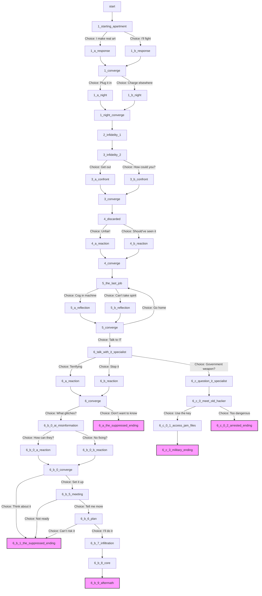

# **JAM?: A Storytelling Game**

## **📌 Overview**
JAM? is a **narrative-driven** interactive game developed in **Unity** using **C#**. The game explores themes of **AI domination**, human creativity, and the struggle for identity in an increasingly automated world. Players take control of **Anita**, a woman whose life is shattered after her job is replaced by AI and her relationship is torn apart by synthetic emotions.

## **🎮 Features**
- **Interactive Storytelling**: The game allows players to make meaningful choices that shape Anita's journey and the world's fate.
- **Multiple Story Paths**: Choices unlock different narrative branches, each leading to unique consequences.
- **Custom Graphics**: All art assets were created in-house by our team.
- **Dynamic Audio System**: A smooth transition system between scene-specific and persistent background music.
- **Save & Load System**: Players can **save progress** and **load previous checkpoints**.

## **🛠️ Development Stack**
- **Engine**: Unity
- **Programming Language**: C#
- **Audio Implementation**: Unity Audio Mixer, adaptive background music transitions
- **Story Format**: JSON-based script for dialogue and scene progression
- **Graphics**: 2D assets designed by our team

## **📜 Gameplay Overview**
The game follows **Anita**, an artist navigating a world increasingly controlled by AI. Players will make critical decisions that define her path, from embracing AI to resisting it or seeking an entirely different solution. Every choice impacts the story and its outcome.

## **🛠️ How to Play**
1. **Launch the Game** in Unity or export a build.
2. **Make Choices** that affect the narrative.
3. **Explore AI's impact** on Anita’s life and the world.
4. **Save and Load Progress** to experience different paths.
5. **Unravel the AI Conspiracy** or find a way to coexist.

## **🎵 Audio & Music**
- Dynamic transitions between **scene-specific and persistent background tracks**.
- **Custom-composed soundtrack** enhances immersion.

## **📁 File Structure**
- **/Assets/** → Unity project files.
- **/Scripts/** → C# scripts for game logic, dialogue system, and audio.
- **/Assets/Resources/** → Custom-made visual assets.
- **/Assets/Resources/Music/** → Sound effects and background music.
- **script.json** → The structured narrative flow and dialogue system.

## **🛠️ Installation & Running the Game**
1. **Open Unity** and load the project folder.
2. Click **Play** in the Unity Editor.
3. To build an executable version:
   - Go to **File > Build Settings**.
   - Select **platform (Windows, macOS, etc.)**.
   - Click **Build & Run**.

## **👥 Development Team**
- **Story & Narrative Design**: Timur Cravțov & Vladimir Vitcovschii & Artur Țugui
- **Programming (C# & Unity)**: Timur Cravțov & Vladimir Vitcovschii & Nicolae Marga & Alexandru Rudoi
- **Art & Graphics**: Timur Cravțov & Vladimir Vitcovschii & Nicolae Marga
- **Sound Design & Music**: Alexandru Rudoi 
- **QA & Playtesting**: Timur Cravțov & Vladimir Vitcovschii & Nicolae Marga & Alexandru Rudoi & Artur Țugui

## **📝 License & Credits**
- All assets and code were created **in-house**.
- This project is **for educational purposes** under the Tehnologii Multimedia course.
- External tools used: Unity, FL Studio.

---
Thank you for checking out JAM?! We hope you enjoy the experience and the philosophical dilemmas it presents. 🚀

Mermaid diagram of the plot:

